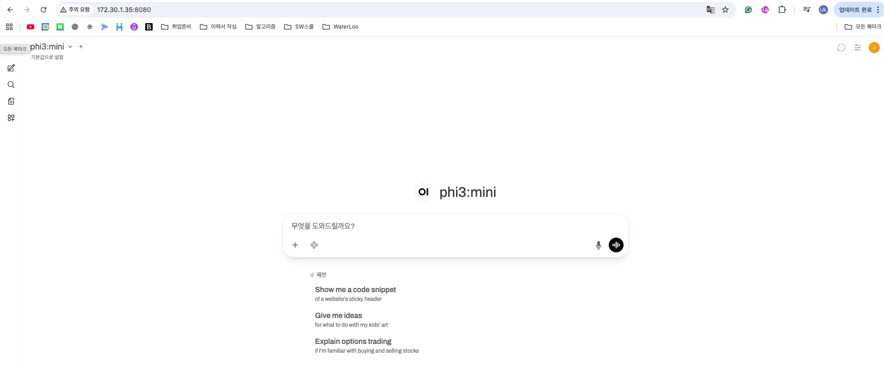

## Done

### 0. EdgeAI 모듈 6까지 완독

### 1. Ubuntu VM위에 Ollama 설치 완료

- VM 리소스 : CPU : 4 Core + RAM : 8GB
- 모델 로딩 및 내부 CLI / API 테스트 완료

### 2. Open WebUI + 외부 API 연동 완료

- Docker 기반 Open WebUI 실행
- Ollama API와 연동해서 WebUI에서 모델 선택 + 대화 가능하도록 설정 완료
    - 외부에서도 Open WebUI 및 Ollama API 접근 가능
        
            

**Open WebUI란?**

- 로컬 환경에서 다양한 LLM을 사용할 수 있게 해주는 웹 기반 통합 인터페이스
- Ollama가 설치된 서버와 연결만 하면 pull받은 모델을 바로 웹에서 사용할 수 있음
- 여러 모델 간 전환이 쉽고 PDF기반 RAG 기능도 지원함

**VM 서버 구조**

```bash
[Mac 브라우저 / API 클라이언트]
       │
       ▼
[Open WebUI (Docker, host network) - port 8080]
       │
       ▼
[Ollama (Ubuntu VM) - port 11434]
       │
       ▼
[GGUF SLM 모델]
```

## 참고 자료

- https://apidog.com/kr/blog/open-webui-ollama-kr/
- https://boksup.tistory.com/97