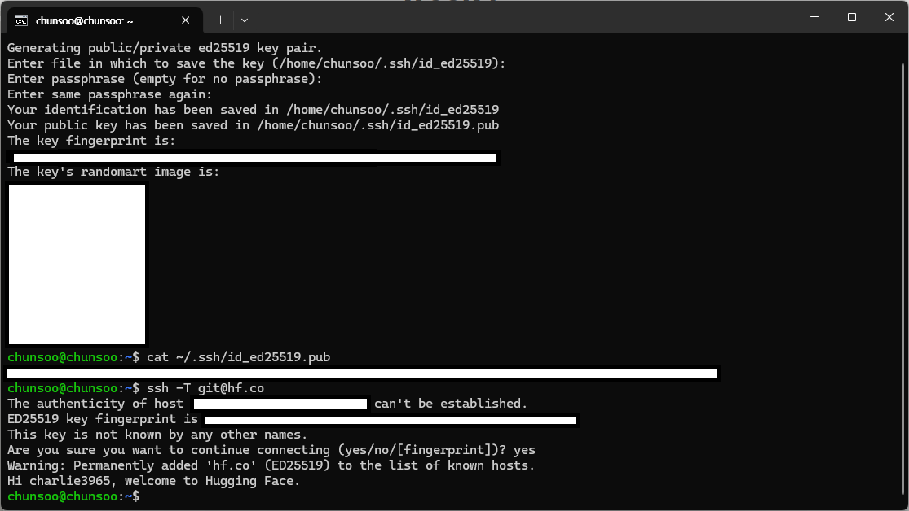
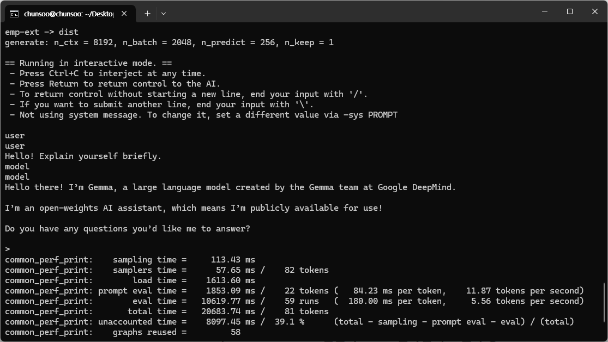

# Week4

## 과제
1. huggingface 가입 및 ssh key 등록
2. gemma3-1b 또는 4b it qat gguf 모델 git clone (ssh) (git-lfs, git-xet 설치 필요)
3. llama.cpp 본인 런타임에 맞게 직접 빌드해보기 (패키지 가져오는 거 x 직접 빌드해야함)
4. llama.cpp로 gguf 모델 구동
5. (정확히 맞는지 모르겠음) onnx로 gemma3-1b 또는 4b it (unquantized도 될 것 같이 보임) onnx 변환 후 onnx 런타임에 모델 구동
6. 마크다운 요약

## 1. huggingface 가입 및 ssh key 등록



- 발급한 ssh public key를 huggingface에 입력

## 2. gemma3-1b 또는 4b it qat gguf 모델 git clone (ssh) (git-lfs, git-xet 설치 필요)

```shell
sudo apt install -y git-lfs
git lfs install

curl --proto '=https' --tlsv1.2 -sSf https://raw.githubusercontent.com/huggingface/xet-core/refs/heads/main/git_xet/install.sh | sh
```

```shell
# 1B IT GGUF
git clone git@hf.co:gaianet/gemma-3-1b-it-GGUF
```

<details>
<summary>pt vs gguf vs onnx</summary>
<div markdown="1">

- [gguf file structure](https://github.com/ggml-org/ggml/blob/master/docs/gguf.md#file-structure)
- [onnx concept](https://onnx.ai/onnx/intro/concepts.html#onnx-concepts)
- Perplexity와 함께 정리했음

| 항목                            | .pt (PyTorch)                                                                                     | GGUF                                                                                                     | ONNX                                                                                                             |
|---------------------------------|----------------------------------------------------------------------------------------------------|----------------------------------------------------------------------------------------------------------|------------------------------------------------------------------------------------------------------------------|
| 개념 · 주요 용도               | PyTorch 모델/state_dict 등을 `torch.save`로 직렬화한 **PyTorch 전용 바이너리**. 연구·학습·파인튜닝 1차 포맷 | GGML·llama.cpp 계열을 위한 **추론 전용 바이너리 포맷**. 로컬 LLM/임베딩 모델 CPU 추론에 최적화             | 서로 다른 프레임워크 간 교환을 위한 **표준 그래프(IR) 포맷**. 다양한 런타임에서 최적화 추론에 사용               |
| 파일 구조 · 내용               | Python 객체(pickle) 직렬화. 딕셔너리/모듈/텐서/옵티마이저/스케줄러/메타데이터 등 PyTorch 내부 형식 의존 | 헤더 + key–value 메타데이터(아키텍처·하이퍼파라미터·토크나이저 등) + 텐서 정보 + 텐서 데이터 섹션           | 프로토버퍼 컨테이너에 연산 그래프, op, 상수 텐서, 메타데이터, 입출력 텐서 정보(dtype/shape 등) 포함               |
| 학습 · 파인튜닝 적합성         | PyTorch에서 바로 로드해 역전파·옵티마이저 사용 가능 → **학습·파인튜닝에 가장 적합**                   | 보통 학습에는 사용하지 않고, **다른 포맷에서 변환된 완성 모델**을 추론용으로 사용                            | 주로 “원 프레임워크에서 학습 후 export된 결과”로 사용. ONNX 자체로 학습하기보다는 **학습 결과 운반용**              |
| 추론 성능 · 최적화             | PyTorch 런타임 + `torch.compile`, TorchScript, 백엔드별 최적화에 의존. 포맷 자체는 추론 특화 아님        | CPU 캐시·메모리 대역폭에 맞춘 레이아웃 + 다양한 저비트 양자화(Q2~Q8)로 **CPU·저사양 환경 로컬 추론**에 최적화 | ONNX Runtime/TensorRT/OpenVINO에서 그래프 최적화·fusion·INT8 양자화 등 적용 → **프로덕션 추론·하드웨어 가속** 유리 |
| 이식성 · 호환성                | 사실상 PyTorch 전용 포맷. 다른 프레임워크에서 직접 읽기 어려워 변환 필요                             | GGML 계열(예: llama.cpp, Ollama)과는 매우 호환성이 높지만, 그 외 생태계에는 직접 호환되지 않음                | 여러 프레임워크·언어·플랫폼이 공통 지원하는 **표준 포맷**. 클라우드·엣지·멀티 플랫폼 간 **이식성 가장 높음**        |
| 양자화 · 모델 크기 · 배포      | FP32/FP16/BF16/torch.quantization 등 사용 가능하나 포맷 핵심 기능은 아님. 대형 LLM은 용량 커서 safetensors·샤딩과 함께 배포 많음 | 포맷 레벨에서 Q2~Q8 등 저비트 양자화 직접 지원 → 같은 모델을 **수배 작게** 만들고 단일 `.gguf` 파일로 배포·즉시 실행 가능 | INT8 중심 양자화를 ONNX Runtime 등에서 지원. 포맷은 범용 텐서 컨테이너, 실제 양자화·그래프 최적화는 런타임/툴이 담당 |
| 적합한 상황 (선택 기준)        | 연구·개발·실험을 계속 PyTorch로 하고, 서버/스크립트도 PyTorch 기반일 때. Python 생태계·디버깅이 중요한 경우 | 로컬 LLM을 **CPU/엣지/저사양 환경에서 돌리고**, “.gguf 하나 받아 바로 로컬 실행” 같은 사용자 경험을 만들고 싶을 때 | “프레임워크 A에서 학습 → B(다른 언어/플랫폼)에서 추론”처럼 **이식성이 중요**하거나, ONNX Runtime/TensorRT 등으로 **최적화된 프로덕션 추론**을 할 때 |


</div>
</details>

## 3. llama.cpp 본인 런타임에 맞게 직접 빌드해보기 (패키지 가져오는 거 x 직접 빌드해야함)

[CPU build 방법](https://github.com/ggml-org/llama.cpp/blob/master/docs/build.md#cpu-build)

```shell
git clone https://github.com/ggml-org/llama.cpp.git
cd llama.cpp
cmake -B build
cmake --build build --config Release
```

## 4. llama.cpp로 gguf 모델 구동

[run easily](https://github.com/ggml-org/llama.cpp?tab=readme-ov-file#a-cli-tool-for-accessing-and-experimenting-with-most-of-llamacpps-functionality)

```shell
./build/bin/llama-cli \
  -m /home/chunsoo/Desktop/gemma-3-1b-it-GGUF/gemma-3-1b-it-Q8_0.gguf \
  -c 8192 \
  -n 256 \
  -t 8 \
  -e \
  -p "<start_of_turn>user
Hello! Explain yourself briefly.<end_of_turn>
<start_of_turn>model"
```



## 5. onnx로 gemma3-1b onnx 변환 후 onnx 런타임에 모델 구동
- gemma3-1b.gguf → gemma3-1b onnx 변환 시도중