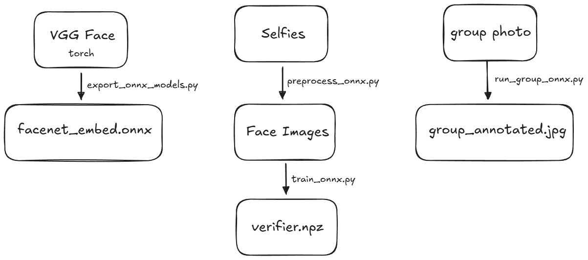

# Week7

## 과제
- 이미지 모델 런타임 후 간단한 인풋 아웃풋 구현해서 보여주기

## 구현한 내용

- torch 모델을 onnx로 변환하고 onnx runtime을 사용해 텐서 추출 및 추론
- `uv sync --extra cpu --extra export`시 VGG Face 변환부터 전체 과정 실습 가능
    - cpu 대신 gpu 넣으면 gpu 사용한다고함 (테스트 안해봄)
    - 단순 추론만 진행시 `--extra export` 옵션 필요 없음

### 폴더 구조
``` text
personal_facenet/
├─ data_faces/
│  └─ me/ # preprocessed face images, this will be created by 
|
├─ data_raw/
│  ├─ group/ # target image to annotate
│  └─ me/ # raw selfies (5 or more)
|
├─ models/ # download or export and relocate (doesn't really matters where it locates)
│  ├─ facenet_embed.onnx
│  └─ yolov11n-face.onnx
|
├─ export_onnx_models.py
├─ group_annotated.jpg # this will be created by executing run_group_onnx.py
├─ preprocess_onnx.py
├─ README.md
├─ run_group_onnx.py
├─ train_onnx.py
└─ verifier.npz # this will be created by executing train_onnx.py

personal_facenet_bundle/ # files to move when inferencing at other devices - except code and group image
├─ facenet_embed.onnx
├─ yolov11n-face.onnx
└─ verifier.npz

```

### 1. onnx 런타임 모델 마련하기
- [yolov11n-face.onnx](https://github.com/YapaLab/yolo-face?tab=readme-ov-file#onnx-models)
- vgg-face.onnx (직접 변환)
    <details>
    <summary>변환 방법</summary>
    <div markdown="1">

    ```Python
    # export_onnx_models.py  (옵션: ONNX 생성용, 여기서는 torch/facenet_pytorch 필요)
    import argparse
    from pathlib import Path
    import torch
    from facenet_pytorch import InceptionResnetV1

    class FaceEmbed(torch.nn.Module):
        def __init__(self):
            super().__init__()
            self.backbone = InceptionResnetV1(pretrained="vggface2").eval()

        def forward(self, x):
            return self.backbone(x)  # (B, 512)

    def main():
        ap = argparse.ArgumentParser()
        ap.add_argument("--embed_onnx", type=str, default="facenet_embed.onnx")
        ap.add_argument("--opset", type=int, default=13)
        args = ap.parse_args()

        m = FaceEmbed().eval()
        dummy = torch.randn(1, 3, 160, 160)

        out = Path(args.embed_onnx)
        out.parent.mkdir(parents=True, exist_ok=True)

        torch.onnx.export(
            m,
            dummy,
            str(out),
            opset_version=args.opset,
            input_names=["face"],
            output_names=["emb"],
            dynamic_axes={"face": {0: "batch"}, "emb": {0: "batch"}},
        )
        print("Saved embed onnx:", out.resolve())

    if __name__ == "__main__":
        main()

    ```

    ``` shell
    python export_onnx_models.py
    ```

    </div>
    </details>

### 2. 모든 추론 onnx runtime으로 실행하기
- [참고](https://github.com/ultralytics/ultralytics/blob/main/examples/YOLOv8-ONNXRuntime/main.py?utm_source=chatgpt.com)
    <details>
    <summary>전처리 (selfie → face image (160, 160))</summary>
    <div markdown="1">

    ```Python
    # preprocess_onnx.py
    import argparse
    from pathlib import Path
    from typing import Iterable, List, Tuple, Optional

    import numpy as np
    from PIL import Image
    from tqdm import tqdm
    import onnxruntime as ort

    IMG_EXT = {".jpg", ".jpeg", ".png", ".webp", ".bmp"}

    def iter_images(p: Path) -> Iterable[Path]:
        if p.is_file():
            yield p
            return
        for f in p.rglob("*"):
            if f.is_file() and f.suffix.lower() in IMG_EXT:
                yield f

    def letterbox(im: np.ndarray, new_shape: Tuple[int,int], color=(114,114,114)) -> Tuple[np.ndarray, float, Tuple[int,int]]:
        """Ultralytics ONNXRuntime 예제의 letterbox 개념(비율 유지 + 패딩) 기반. :contentReference[oaicite:6]{index=6}"""
        shape = im.shape[:2]  # (h,w)
        h0, w0 = shape
        h1, w1 = new_shape

        r = min(h1 / h0, w1 / w0)
        new_unpad = (int(round(w0 * r)), int(round(h0 * r)))  # (w,h)

        im_resized = np.array(Image.fromarray(im).resize(new_unpad, Image.BILINEAR))
        dw = w1 - new_unpad[0]
        dh = h1 - new_unpad[1]
        dw //= 2
        dh //= 2

        out = np.full((h1, w1, 3), color, dtype=np.uint8)
        out[dh:dh + new_unpad[1], dw:dw + new_unpad[0], :] = im_resized
        return out, r, (dw, dh)

    def sigmoid(x: np.ndarray) -> np.ndarray:
        return 1 / (1 + np.exp(-x))

    def nms_xyxy(boxes: np.ndarray, scores: np.ndarray, iou_thres: float) -> List[int]:
        """간단 NMS(ORT-only)."""
        x1, y1, x2, y2 = boxes[:,0], boxes[:,1], boxes[:,2], boxes[:,3]
        areas = (x2 - x1 + 1e-6) * (y2 - y1 + 1e-6)
        order = scores.argsort()[::-1]
        keep = []
        while order.size > 0:
            i = order[0]
            keep.append(int(i))
            if order.size == 1:
                break
            xx1 = np.maximum(x1[i], x1[order[1:]])
            yy1 = np.maximum(y1[i], y1[order[1:]])
            xx2 = np.minimum(x2[i], x2[order[1:]])
            yy2 = np.minimum(y2[i], y2[order[1:]])
            w = np.maximum(0.0, xx2 - xx1)
            h = np.maximum(0.0, yy2 - yy1)
            inter = w * h
            iou = inter / (areas[i] + areas[order[1:]] - inter + 1e-6)
            inds = np.where(iou <= iou_thres)[0]
            order = order[inds + 1]
        return keep

    def decode_ultralytics_output(out: np.ndarray, conf_thres: float, iou_thres: float) -> np.ndarray:
        """
        1) NMS 포함 export(nms=True)인 경우: (1,N,6) 형태(x1,y1,x2,y2,score,cls)로 나오는 경우가 많음.
        2) NMS 없는 경우: (1,84,8400) 또는 (1,8400,84) 같이 나올 수 있어 최소한의 디코딩 제공.
        """
        out = np.array(out)
        if out.ndim == 3 and out.shape[-1] == 6:
            det = out[0]
            det = det[det[:,4] >= conf_thres]
            return det

        # fallback: (1, C, N) or (1, N, C)
        x = out[0]
        if x.shape[0] < x.shape[1]:
            # (C,N) -> (N,C)
            x = x.T

        # x: (N, 4+nc) or (N, 5+nc)
        # Ultralytics ONNX는 모델/버전에 따라 다르므로, 여기선 "가장 흔한 케이스"만 처리:
        # - 첫 4개: xywh (center-x,center-y,width,height) in input scale
        # - 나머지: class scores (nc>=1)
        xywh = x[:, :4]
        cls_scores = x[:, 4:]  # (N,nc)
        if cls_scores.shape[1] == 0:
            return np.zeros((0,6), dtype=np.float32)

        scores = cls_scores.max(axis=1)
        cls = cls_scores.argmax(axis=1).astype(np.float32)

        mask = scores >= conf_thres
        xywh, scores, cls = xywh[mask], scores[mask], cls[mask]
        if xywh.shape[0] == 0:
            return np.zeros((0,6), dtype=np.float32)

        # xywh -> xyxy
        cx, cy, w, h = xywh[:,0], xywh[:,1], xywh[:,2], xywh[:,3]
        x1 = cx - w/2
        y1 = cy - h/2
        x2 = cx + w/2
        y2 = cy + h/2
        boxes = np.stack([x1,y1,x2,y2], axis=1).astype(np.float32)

        keep = nms_xyxy(boxes, scores.astype(np.float32), iou_thres)
        boxes = boxes[keep]
        scores = scores[keep]
        cls = cls[keep]
        det = np.concatenate([boxes, scores[:,None].astype(np.float32), cls[:,None].astype(np.float32)], axis=1)
        return det

    def main():
        ap = argparse.ArgumentParser()
        ap.add_argument("--input", type=str, required=True)
        ap.add_argument("--output", type=str, default="faces_out")
        ap.add_argument("--yolo_onnx", type=str, required=True)
        ap.add_argument("--conf", type=float, default=0.5)
        ap.add_argument("--iou", type=float, default=0.5)
        ap.add_argument("--margin_ratio", type=float, default=0.25)
        ap.add_argument("--keep_all", action="store_true")
        ap.add_argument("--pick", choices=["best","largest"], default="best")
        ap.add_argument("--face_size", type=int, default=160)
        ap.add_argument("--providers", type=str, default="CPUExecutionProvider")
        args = ap.parse_args()

        inp = Path(args.input)
        outdir = Path(args.output)
        outdir.mkdir(parents=True, exist_ok=True)

        providers = [p.strip() for p in args.providers.split(",") if p.strip()]
        sess = ort.InferenceSession(args.yolo_onnx, providers=providers) 
        in0 = sess.get_inputs()[0]
        in_name = in0.name
        # 입력 shape에서 H,W 추론(대부분 [1,3,H,W])
        _, _, H, W = [int(x) if isinstance(x, (int, np.integer)) else 640 for x in in0.shape]

        paths = list(iter_images(inp))
        if not paths:
            raise SystemExit("입력에서 이미지 파일을 찾지 못했습니다.")

        saved, failed = 0, 0

        for src in tqdm(paths, desc="preprocess_onnx"):
            rel = src.name if inp.is_file() else src.relative_to(inp)
            rel = Path(rel)

            try:
                img = Image.open(src).convert("RGB")
            except Exception:
                failed += 1
                continue

            im0 = np.array(img)  # HWC RGB uint8
            lb, r, (dw, dh) = letterbox(im0, (H, W))
            x = lb.astype(np.float32) / 255.0  # Ultralytics ORT 예제에서 /255 정규화
            x = np.transpose(x, (2,0,1))[None, ...]  # 1,3,H,W

            outputs = sess.run(None, {in_name: x})
            det = decode_ultralytics_output(outputs[0], args.conf, args.iou)

            if det.shape[0] == 0:
                failed += 1
                continue

            # bbox를 letterbox 좌표계 -> 원본 좌표계로 복원
            boxes = det[:, :4].copy()
            boxes[:, [0,2]] -= dw
            boxes[:, [1,3]] -= dh
            boxes /= max(r, 1e-6)

            # margin 적용
            h0, w0 = im0.shape[0], im0.shape[1]
            out_faces = []
            for i in range(boxes.shape[0]):
                x1,y1,x2,y2 = boxes[i]
                bw = x2 - x1
                bh = y2 - y1
                mx = bw * args.margin_ratio
                my = bh * args.margin_ratio
                x1m = int(max(0, x1 - mx))
                y1m = int(max(0, y1 - my))
                x2m = int(min(w0-1, x2 + mx))
                y2m = int(min(h0-1, y2 + my))
                face = img.crop((x1m,y1m,x2m,y2m)).resize((args.face_size, args.face_size))
                out_faces.append((face, float(det[i,4])))

            if not args.keep_all:
                # 1개만 저장(best/ largest)
                if args.pick == "best":
                    face = max(out_faces, key=lambda t: t[1])[0]
                else:
                    # largest
                    areas = []
                    for i in range(boxes.shape[0]):
                        x1,y1,x2,y2 = boxes[i]
                        areas.append((i, max(0.0,(x2-x1))*max(0.0,(y2-y1))))
                    idx = max(areas, key=lambda t: t[1])[0]
                    face = out_faces[idx][0]

                dst = outdir / rel
                dst.parent.mkdir(parents=True, exist_ok=True)
                face.save(dst)
                saved += 1
            else:
                for i,(face,_) in enumerate(out_faces):
                    dst = outdir / rel.parent / f"{rel.stem}_{i}{rel.suffix.lower()}"
                    dst.parent.mkdir(parents=True, exist_ok=True)
                    face.save(dst)
                    saved += 1

        print(f"done: saved={saved}, failed={failed}, out_dir={outdir.resolve()}, providers={providers}")

    if __name__ == "__main__":
        main()

    ```

    ``` shell
    python preprocess_onnx.py --input data_raw/me --output data_faces/me --yolo_onnx models/yolov11n-face.onnx   
    ```

    </div>
    </details>

    <details>
    <summary>모델 학습</summary>
    <div markdown="1">

    ```Python
    # train_onnx.py
    import argparse
    from pathlib import Path
    from typing import List, Optional, Tuple

    import numpy as np
    from PIL import Image
    from tqdm import tqdm
    import onnxruntime as ort 

    IMG_EXT = {".jpg", ".jpeg", ".png", ".webp", ".bmp"}

    def list_images(d: Path) -> List[Path]:
        return sorted([p for p in d.rglob("*") if p.is_file() and p.suffix.lower() in IMG_EXT])

    def fixed_image_standardization(img_255: np.ndarray) -> np.ndarray:
        # facenet-pytorch fixed_image_standardization: (x - 127.5) / 128.0 
        return (img_255.astype(np.float32) - 127.5) / 128.0

    def l2norm(x: np.ndarray, axis: int = -1, eps: float = 1e-12) -> np.ndarray:
        return x / (np.linalg.norm(x, axis=axis, keepdims=True) + eps)

    def embed_one(sess: ort.InferenceSession, in_name: str, img_path: Path) -> Optional[np.ndarray]:
        try:
            img = Image.open(img_path).convert("RGB").resize((160,160))
        except Exception:
            return None
        arr = np.asarray(img).astype(np.float32)  # HWC [0,255]
        arr = fixed_image_standardization(arr)    # HWC
        x = np.transpose(arr, (2,0,1))[None, ...].astype(np.float32)  # 1,3,160,160
        out = sess.run(None, {in_name: x})[0]     # 1,512
        e = l2norm(out, axis=1)[0]                # (512,)
        return e.astype(np.float32)

    def choose_threshold(me_scores: np.ndarray, other_scores: np.ndarray, target_far: Optional[float]) -> Tuple[float, dict]:
        all_scores = np.concatenate([me_scores, other_scores])
        lo, hi = float(all_scores.min()), float(all_scores.max())
        thresholds = np.linspace(lo, hi, 400)

        best_key = None
        best = None

        for th in thresholds:
            tp = (me_scores >= th).sum()
            fn = (me_scores < th).sum()
            fp = (other_scores >= th).sum()
            tn = (other_scores < th).sum()

            tpr = tp / max(1, tp + fn)
            fpr = fp / max(1, fp + tn)
            prec = tp / max(1, tp + fp)
            rec = tpr
            f1 = (2 * prec * rec) / max(1e-12, prec + rec)

            if target_far is not None:
                if fpr <= target_far:
                    key = (tpr, -fpr)
                else:
                    continue
            else:
                key = (f1, -fpr)

            if best_key is None or key > best_key:
                best_key = key
                best = (th, tpr, fpr, prec, rec, f1)

        if best is None:
            th = float(np.max(thresholds))
            return th, {"warning": "target_far를 만족하는 threshold를 찾지 못해 가장 보수적으로 설정"}

        th, tpr, fpr, prec, rec, f1 = best
        return float(th), {"tpr": float(tpr), "fpr": float(fpr), "precision": float(prec), "recall": float(rec), "f1": float(f1)}

    def main():
        ap = argparse.ArgumentParser()
        ap.add_argument("--me_dir", type=str, required=True, help="내 얼굴 크롭 폴더(preprocess_onnx 결과)")
        ap.add_argument("--others_dir", type=str, default="", help="타인 얼굴 크롭 폴더(선택)")
        ap.add_argument("--embed_onnx", type=str, required=True, help="facenet_embed.onnx")
        ap.add_argument("--out", type=str, default="verifier.npz")
        ap.add_argument("--reject_rate", type=float, default=0.05, help="others 없을 때: me 점수 하위 분위수")
        ap.add_argument("--target_far", type=float, default=None, help="others 있을 때: FAR 목표(예 0.001)")
        ap.add_argument("--temperature", type=float, default=12.0)
        ap.add_argument("--providers", type=str, default="CPUExecutionProvider")
        args = ap.parse_args()

        me_paths = list_images(Path(args.me_dir))
        if not me_paths:
            raise SystemExit("me_dir에 이미지가 없습니다.")

        others_paths = list_images(Path(args.others_dir)) if args.others_dir else []

        providers = [p.strip() for p in args.providers.split(",") if p.strip()]
        sess = ort.InferenceSession(args.embed_onnx, providers=providers)  
        in_name = sess.get_inputs()[0].name

        me_embs = []
        for p in tqdm(me_paths, desc="embed me"):
            e = embed_one(sess, in_name, p)
            if e is not None:
                me_embs.append(e)
        if len(me_embs) == 0:
            raise SystemExit("me 임베딩 생성 실패(이미지/모델 확인).")
        me_embs = np.stack(me_embs, axis=0)  # (Nm,512)

        centroid = l2norm(me_embs.mean(axis=0, keepdims=False), axis=0).astype(np.float32)  # (512,)
        me_scores = (me_embs @ centroid).astype(np.float32)

        info = {"mode": "", "detail": {}}
        if len(others_paths) > 0:
            other_embs = []
            for p in tqdm(others_paths, desc="embed others"):
                e = embed_one(sess, in_name, p)
                if e is not None:
                    other_embs.append(e)
            if len(other_embs) == 0:
                print("[WARN] others_dir가 있었지만 임베딩이 0개라 me-only로 진행합니다.")
            else:
                other_embs = np.stack(other_embs, axis=0)
                other_scores = (other_embs @ centroid).astype(np.float32)
                th, detail = choose_threshold(me_scores, other_scores, args.target_far)
                threshold = th
                info["mode"] = "calibrated_with_others"
                info["detail"] = detail
        if info["mode"] == "":
            threshold = float(np.quantile(me_scores, args.reject_rate))
            info["mode"] = "me_only_quantile"
            info["detail"] = {"reject_rate": args.reject_rate}

        np.savez(
            args.out,
            centroid=centroid,
            threshold=np.array([threshold], dtype=np.float32),
            temperature=np.array([args.temperature], dtype=np.float32),
            info=np.array([str(info)], dtype=object),
        )
        print(f"Saved: {args.out}")
        print(f"threshold={threshold:.4f} mode={info['mode']} providers={providers}")

    if __name__ == "__main__":
        main()

    ```

    ``` shell
    python train_onnx.py --me_dir data_faces/me --embed_onnx models/facenet_embed.onnx    
    ```

    </div>
    </details>

    <details>
    <summary>추론 (단체사진에서 내 얼굴 찾기)</summary>
    <div markdown="1">

    ```Python
    # run_group_onnx.py
    import argparse
    from pathlib import Path
    from typing import List, Tuple, Optional

    import numpy as np
    from PIL import Image, ImageDraw, ImageFont
    import onnxruntime as ort  

    # -----------------------------
    # Utils (no torch)
    # -----------------------------
    def fixed_image_standardization(img_255_hwc: np.ndarray) -> np.ndarray:
        # facenet-pytorch fixed_image_standardization: (x - 127.5) / 128.0 
        return (img_255_hwc.astype(np.float32) - 127.5) / 128.0


    def l2norm(x: np.ndarray, axis: int = -1, eps: float = 1e-12) -> np.ndarray:
        return x / (np.linalg.norm(x, axis=axis, keepdims=True) + eps)


    def sigmoid(x: np.ndarray) -> np.ndarray:
        return 1.0 / (1.0 + np.exp(-x))


    def letterbox(im: np.ndarray, new_shape: Tuple[int, int], color=(114, 114, 114)):
        """
        Ultralytics 계열 ONNX 추론에서 흔히 쓰는 letterbox(비율 유지 + 패딩) 전처리.
        (YOLO ONNX 출력 후처리는 모델/옵션에 따라 달라서, 아래 decode에서 몇 가지 케이스를 처리함)
        """
        h0, w0 = im.shape[:2]
        h1, w1 = new_shape

        r = min(h1 / h0, w1 / w0)
        new_unpad = (int(round(w0 * r)), int(round(h0 * r)))  # (w, h)

        im_resized = np.array(Image.fromarray(im).resize(new_unpad, Image.BILINEAR))
        dw = w1 - new_unpad[0]
        dh = h1 - new_unpad[1]
        dw //= 2
        dh //= 2

        out = np.full((h1, w1, 3), color, dtype=np.uint8)
        out[dh:dh + new_unpad[1], dw:dw + new_unpad[0], :] = im_resized
        return out, r, (dw, dh)


    def nms_xyxy(boxes: np.ndarray, scores: np.ndarray, iou_thres: float) -> List[int]:
        """간단 NMS."""
        if boxes.size == 0:
            return []
        x1, y1, x2, y2 = boxes[:, 0], boxes[:, 1], boxes[:, 2], boxes[:, 3]
        areas = (x2 - x1 + 1e-6) * (y2 - y1 + 1e-6)
        order = scores.argsort()[::-1]
        keep = []

        while order.size > 0:
            i = order[0]
            keep.append(int(i))
            if order.size == 1:
                break
            xx1 = np.maximum(x1[i], x1[order[1:]])
            yy1 = np.maximum(y1[i], y1[order[1:]])
            xx2 = np.minimum(x2[i], x2[order[1:]])
            yy2 = np.minimum(y2[i], y2[order[1:]])
            w = np.maximum(0.0, xx2 - xx1)
            h = np.maximum(0.0, yy2 - yy1)
            inter = w * h
            iou = inter / (areas[i] + areas[order[1:]] - inter + 1e-6)
            inds = np.where(iou <= iou_thres)[0]
            order = order[inds + 1]

        return keep


    def decode_yolo_output(raw: np.ndarray, conf_thres: float, iou_thres: float) -> np.ndarray:
        """
        YOLO-face ONNX 출력은 export 옵션(nms 포함 여부)과 버전에 따라 달라질 수 있음.
        여기서는 실무에서 자주 만나는 케이스를 처리:

        A) NMS 포함 export: (1, N, 6) = [x1, y1, x2, y2, score, cls]
        B) NMS 미포함 export: (1, C, N) 또는 (1, N, C) 형태에서
        첫 4개 = xywh, 나머지 = class score(들). face-only면 nc=1인 경우가 흔함.

        반환: det (M, 6) with xyxy in model-input scale (letterboxed), score, cls
        """
        out = np.asarray(raw)

        # Case A
        if out.ndim == 3 and out.shape[-1] == 6:
            det = out[0]
            det = det[det[:, 4] >= conf_thres]
            return det.astype(np.float32)

        # Case B (fallback)
        x = out[0]
        if x.ndim != 2:
            return np.zeros((0, 6), dtype=np.float32)

        # (C, N) -> (N, C)
        if x.shape[0] < x.shape[1]:
            x = x.T

        if x.shape[1] < 5:
            return np.zeros((0, 6), dtype=np.float32)

        xywh = x[:, :4]
        cls_scores = x[:, 4:]  # (N, nc)
        scores = cls_scores.max(axis=1)
        cls = cls_scores.argmax(axis=1).astype(np.float32)

        mask = scores >= conf_thres
        xywh = xywh[mask]
        scores = scores[mask]
        cls = cls[mask]
        if xywh.shape[0] == 0:
            return np.zeros((0, 6), dtype=np.float32)

        cx, cy, w, h = xywh[:, 0], xywh[:, 1], xywh[:, 2], xywh[:, 3]
        x1 = cx - w / 2
        y1 = cy - h / 2
        x2 = cx + w / 2
        y2 = cy + h / 2
        boxes = np.stack([x1, y1, x2, y2], axis=1).astype(np.float32)

        keep = nms_xyxy(boxes, scores.astype(np.float32), iou_thres)
        boxes = boxes[keep]
        scores = scores[keep]
        cls = cls[keep]

        det = np.concatenate(
            [boxes, scores[:, None].astype(np.float32), cls[:, None].astype(np.float32)],
            axis=1
        )
        return det.astype(np.float32)


    def to_original_coords(det_xyxy: np.ndarray, r: float, dw: int, dh: int) -> np.ndarray:
        """
        letterbox 좌표계 -> 원본 좌표계 복원
        """
        boxes = det_xyxy.copy().astype(np.float32)
        boxes[:, [0, 2]] -= float(dw)
        boxes[:, [1, 3]] -= float(dh)
        boxes /= max(r, 1e-6)
        return boxes


    def crop_with_margin(img: Image.Image, xyxy: np.ndarray, margin_ratio: float) -> Image.Image:
        """
        xyxy in original image coords
        """
        x1, y1, x2, y2 = xyxy.tolist()
        w = x2 - x1
        h = y2 - y1
        mx = w * margin_ratio
        my = h * margin_ratio

        W, H = img.size
        x1m = int(max(0, x1 - mx))
        y1m = int(max(0, y1 - my))
        x2m = int(min(W - 1, x2 + mx))
        y2m = int(min(H - 1, y2 + my))
        return img.crop((x1m, y1m, x2m, y2m)).resize((160, 160))


    # -----------------------------
    # Main
    # -----------------------------
    def main():
        ap = argparse.ArgumentParser()
        ap.add_argument("--img", type=str, required=True, help="단체 사진 경로")
        ap.add_argument("--yolo_onnx", type=str, required=True, help="yolo_face.onnx")
        ap.add_argument("--embed_onnx", type=str, required=True, help="facenet_embed.onnx")
        ap.add_argument("--verifier_npz", type=str, required=True, help="verifier.npz (centroid/threshold)")
        ap.add_argument("--out_img", type=str, default="group_result.jpg", help="bbox 그려서 저장할 이미지")
        ap.add_argument("--conf", type=float, default=0.35)
        ap.add_argument("--iou", type=float, default=0.5)
        ap.add_argument("--margin_ratio", type=float, default=0.25)
        ap.add_argument("--topk", type=int, default=5, help="점수 상위 K개만 표시")
        ap.add_argument("--min_prob", type=float, default=0.3, help="내 얼굴로 표시할 최소 prob(me)")
        ap.add_argument("--providers", type=str, default="CPUExecutionProvider", help="예: CPUExecutionProvider 또는 CUDAExecutionProvider")
        args = ap.parse_args()

        providers = [p.strip() for p in args.providers.split(",") if p.strip()]

        # Load verifier (centroid/threshold/temperature)
        v = np.load(args.verifier_npz, allow_pickle=True)
        centroid = v["centroid"].astype(np.float32)          # (512,)
        score_th = float(v["threshold"].reshape(-1)[0])      # cosine threshold
        temp = float(v["temperature"].reshape(-1)[0])

        # ORT sessions
        yolo_sess = ort.InferenceSession(args.yolo_onnx, providers=providers)   
        emb_sess  = ort.InferenceSession(args.embed_onnx, providers=providers)

        yolo_in = yolo_sess.get_inputs()[0]
        yolo_in_name = yolo_in.name

        # YOLO input size (대부분 1x3xHxW)
        shape = yolo_in.shape
        H = int(shape[2]) if isinstance(shape[2], (int, np.integer)) else 640
        W = int(shape[3]) if isinstance(shape[3], (int, np.integer)) else 640

        img = Image.open(Path(args.img)).convert("RGB")
        im0 = np.asarray(img)

        # preprocess for YOLO
        lb, r, (dw, dh) = letterbox(im0, (H, W))
        x = (lb.astype(np.float32) / 255.0)  # YOLO 계열에서 흔한 입력 스케일 
        x = np.transpose(x, (2, 0, 1))[None, ...].astype(np.float32)

        # run YOLO
        yolo_out = yolo_sess.run(None, {yolo_in_name: x})[0]
        det = decode_yolo_output(yolo_out, conf_thres=args.conf, iou_thres=args.iou)
        if det.shape[0] == 0:
            raise SystemExit("얼굴을 찾지 못했습니다(검출 결과 0). conf를 낮춰보세요.")

        # map boxes to original image coords
        boxes_orig = to_original_coords(det[:, :4], r=r, dw=dw, dh=dh)

        # embed each face
        emb_in_name = emb_sess.get_inputs()[0].name
        results = []
        for i in range(det.shape[0]):
            face = crop_with_margin(img, boxes_orig[i], margin_ratio=args.margin_ratio)
            arr = np.asarray(face).astype(np.float32)              # HWC [0,255]
            arr = fixed_image_standardization(arr)                 
            inp = np.transpose(arr, (2, 0, 1))[None, ...].astype(np.float32)  # 1,3,160,160

            emb = emb_sess.run(None, {emb_in_name: inp})[0]        # 1,512
            emb = l2norm(emb, axis=1)[0].astype(np.float32)

            score = float(emb @ centroid)                          # cosine similarity
            prob = float(sigmoid((score - score_th) * temp))       # 0~1

            results.append({
                "idx": i,
                "box": boxes_orig[i].astype(float),  # x1,y1,x2,y2
                "det_score": float(det[i, 4]),
                "score": score,
                "prob": prob
            })

        # sort by "prob" desc
        results.sort(key=lambda d: d["prob"], reverse=True)
        show = results[: max(1, args.topk)]

        # draw
        out_img = img.copy()
        draw = ImageDraw.Draw(out_img)
        try:
            font = ImageFont.load_default()
        except Exception:
            font = None

        found_any = False
        for d in show:
            x1, y1, x2, y2 = d["box"]
            label = f"p={d['prob']:.2f} s={d['score']:.2f}"
            is_me = d["prob"] >= args.min_prob

            # bbox
            draw.rectangle([x1, y1, x2, y2], outline=(0, 255, 0) if is_me else (255, 255, 0), width=3)
            # text background
            tx1, ty1 = x1, max(0, y1 - 12)
            draw.text((tx1, ty1), ("ME " if is_me else "?? ") + label, fill=(0, 0, 0), font=font)
            if is_me:
                found_any = True

        Path(args.out_img).parent.mkdir(parents=True, exist_ok=True)
        out_img.save(args.out_img)

        print(f"[Saved] {args.out_img}")
        print(f"[Verifier] score_th={score_th:.4f}, temp={temp:.2f}, min_prob={args.min_prob:.2f}")
        print(f"[Detections] total={len(results)} shown={len(show)} providers={providers}")

        # print "ME candidates"
        me_cands = [d for d in results if d["prob"] >= args.min_prob]
        if not me_cands:
            print("내 얼굴 후보를 찾지 못했습니다. (min_prob 낮추거나, verifier/모델/전처리를 확인하세요.)")
        else:
            print("내 얼굴 후보(상위):")
            for d in me_cands[:10]:
                x1, y1, x2, y2 = d["box"]
                print(f" - prob={d['prob']:.3f} score={d['score']:.3f} box=[{x1:.1f},{y1:.1f},{x2:.1f},{y2:.1f}]")


    if __name__ == "__main__":
        main()

    ```

    ``` shell
    python run_group_onnx.py --img .\data_raw\group\IMG_8146.JPG --yolo_onnx models/yolov11n-face.onnx --embed_onnx models/facenet_embed.onnx --verifier_npz verifier.npz --out_img group_annotated.jpg
    ```

    </div>
    </details>

### 결과물
- 단체 사진 위의 내 얼굴에 초록색 상자가 있으면 성공

## 다음에 해볼 것?
- 아이폰에도 비슷한게 있더라고요. Flutter에 onnx api가 있던데 모바일(아마 안드로이드) 앱으로도 한번 올려서 돌아가는지 + `.npz` 공유해서 탐지까지 해보고 싶습니다.